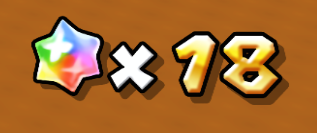
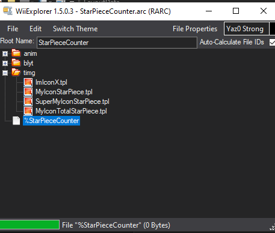

# InArcHotswap
This module allows you to swap certain files within .arc archives.

It's like GLE's Archive Hotswapping, but within the .arc file.

The primary advantage of this is being able to swap files in archives that are always in memory, like MarioConst.arc, which has parameters for Mario/Luigi's movement.

# Dependencies
This module requires two other modules to function:
- [SuperFlag API](https://github.com/AwesomeTMC/SuperFlag) for conditionals
- [PT Utils](https://github.com/Lord-G-INC/Modular-PTD/tree/main/PTD/PTUtils) for archive loading

Make sure to read up on how to make a SuperFlag.

# How to use
First, grab [this template](/disc/ObjectData/InArcHotswap.arc) and put it in `ObjectData`.

Next, open the archive in Whitehole's BCSV editor.

Archive: `/ObjectData/InArcHotswap.arc`

File: `/InArcHotswap/InArcHotswap.bcsv`

Then, add a new row.

Here are the fields:

| Field | Type | Short Description |
|-----------------|------|-------------------|
|ResourceName|String|The name of the file inside the .arc to be swapped. Don't include the folder path.|
|Param00Str|String|The name of the file to give when the game asks for the file in ResourceName.|
|Param01|String|(Optional) .arc identifier that must be in the same .arc file to swap.|
|FlagName|String|The flag in SuperFlag that must be active for the swap to occur.|

This is quite complicated, so here's an example.

Say we want to swap this specific starbit icon here: 

The image it gets is from `LayoutData/StarPieceCounter.arc`, and in the archive's `timg` folder, it's `MyIconStarPiece.tpl`.

So in `ResourceName`, put `MyIconStarPiece.tpl`, despite it being in the `timg` folder, because only the *name* (and the extension) matters.

Edit the tpl (and put it in the archive) and put the new name, `NewMyIconStarPiece.tpl`, or whatever you want to call it, in `Param00Str`.

If you are fairly confident that no other archive has a file with the name in `ResourceName` (like with this file), you can leave `Param01` blank and skip this next part.

If there are multiple archives that have the same file names internally, you may want to discern them from each other. Due to how the game's code works, this module can't check what .arc file it's in. But it can check what other files are in the same .arc file. This is where the identifier comes in. Add an empty, extensionless file starting with a % (`%StarPieceCounter` for example).

Anything after the % is what you put in `Param01`. For example, you'd put `StarPieceCounter`.

To specify the conditions for the file swap, SuperFlag is used. Put the Flag Name in `FlagName`, and if the flag is active at the time the file is loaded it'll swap the file.

[Read more on how to make a Super Flag here](https://github.com/AwesomeTMC/SuperFlag).

# Limitations
Several files cannot be swapped due to various reasons. See the section below for a general idea of what works.

Circular hotswapping will (likely) cause a crash. This is circular hotswapping:

Circular hotswapping crashes *may* be avoided by adding an Identifier to the .arc and changing the BCSV accordingly.

Swapping only happens when the game asks for the file. This could be never, once per game, once per level, etc. Generally, it's once per level, but see the section below.

# What works?
This table is a general list of what StationedFileInfo archives can be swapped.
If anything seems inaccurate (or you would like to contribute!), please open an issue on GitHub. Either way, you should test things out yourself to make sure.

This table is based on GLE's StationedFileInfo. There are a bunch of files that appear in "vanilla"'s StationedFileInfo that aren't on here.

For most (if not all) BDL/BMD files, you will likely have to use the name without the extension. For instance "Coin" instead of "Coin.bdl".

Key:

:x: = Swapping doesn't work at all.

:o: = Swapping all files in the archive works.

:heavy_minus_sign: = Swapping some files works.

:white_circle: = Swapping is possible, but only upon boot up.

:question: = Untested

|Arc File|Works?|Notes|
|----------------------------------------|--------------|------------------------------------------|
|`/HomeButton2/SpeakerSe.arc`|:x:||
|`/HomeButton2/config.txt`|:x:||
|`/HomeButton2/home.csv`|:x:||
|`/LayoutData/AirMeter.arc`|:o:||
|`/LayoutData/AllStarList.arc`|:o:||
|`/LayoutData/BackButton.arc`|:question:||
|`/LayoutData/BatteryInfo.arc`|:question:||
|`/LayoutData/CameraInfo.arc`|:question:||
|`/LayoutData/CinemaFrame.arc`|:question:||
|`/LayoutData/CoinCounter.arc`|:question:||
|`/LayoutData/CollectCounter.arc`|:question:||
|`/LayoutData/CometMedalCounter.arc`|:question:||
|`/LayoutData/CometScreenFilter.arc`|:question:||
|`/LayoutData/DPDPointer.arc`|:question:||
|`/LayoutData/DPDPointerNumber.arc`|:question:||
|`/LayoutData/DPDPointerSub.arc`|:question:||
|`/LayoutData/FlyMeter.arc`|:question:||
|`/LayoutData/Font.arc`|:white_circle:||
|`/LayoutData/GalaxyNamePlate.arc`|:question:||
|`/LayoutData/GameOver.arc`|:question:||
|`/LayoutData/GetStar.arc`|:question:||
|`/LayoutData/HitPointMeter.arc`|:question:||
|`/LayoutData/HomeButton.arc`|:question:||
|`/LayoutData/IconAButton.arc`|:question:||
|`/LayoutData/IconSave.arc`|:question:||
|`/LayoutData/InformationWindow.arc`|:question:||
|`/LayoutData/LoadIcon.arc`|:x:|Swap happens before InArcHotswap is initialized.|
|`/LayoutData/OneUp.arc`|:question:||
|`/LayoutData/PauseMenu.arc`|:question:||
|`/LayoutData/PlayerLeft.arc`|:question:||
|`/LayoutData/PointerGuidance.arc`|:question:||
|`/LayoutData/ResultWindow.arc`|:question:||
|`/LayoutData/ScenarioSelect.arc`|:x:||
|`/LayoutData/SelectButton.arc`|:question:||
|`/LayoutData/SignBoardBalloon.arc`|:question:||
|`/LayoutData/StageTitle.arc`|:question:||
|`/LayoutData/StarCounter.arc`|:question:||
|`/LayoutData/StarPieceCounter.arc`|:question:||
|`/LayoutData/SuddenDeathMeter.arc`|:question:||
|`/LayoutData/SupportPlayGuidance.arc`|:question:||
|`/LayoutData/SysInfoWindow.arc`|:question:||
|`/LayoutData/SysInfoWindowMini.arc`|:question:||
|`/LayoutData/TalkBalloonEvent.arc`|:question:||
|`/LayoutData/TalkBalloonLetter.arc`|:question:||
|`/LayoutData/TalkBalloonStretch.arc`|:question:||
|`/LayoutData/TooBad.arc`|:question:||
|`/LayoutData/WipeKoopa.arc`|:question:||
|`/LayoutData/WipeMario.arc`|:question:||
|`/LayoutData/WipeRing.arc`|:question:||
|`/LayoutData/YoshiTargetMark.arc`|:question:||
|`/LightData/LightData.arc`|:o:|Why though?|
|`/MessageData/LayoutMessage.arc`|:x:||
|`/MessageData/SceneCommonMessage.arc`|:x:||
|`/MessageData/SystemMessage.arc`|:x:||
|`/ModuleData/HomeButtonMenuWrapperRSO.rso`|:x:||
|`/ModuleData/product.sel`|:x:||
|`/ObjectData/BoneLuigi.arc`|:o:||
|`/ObjectData/BoneMario.arc`|:o:||
|`/ObjectData/Coin.arc`|:o:||
|`/ObjectData/ErrorMessageImage.arc`|:x:|Swap happens before InArcHotswap is initialized.|
|`/ObjectData/GrandStar.arc`|:o:||
|`/ObjectData/KinokoLifeUp.arc`|:o:||
|`/ObjectData/KinokoOneUp.arc`|:o:||
|`/ObjectData/Koura.arc`|:o:||
|`/ObjectData/Luigi.arc`|:question:||
|`/ObjectData/LuigiFace.arc`|:question:||
|`/ObjectData/LuigiHair.arc`|:question:||
|`/ObjectData/LuigiShadow.arc`|:question:||
|`/ObjectData/Mario.arc`|:o:||
|`/ObjectData/MarioAnime.arc`|:o:|While I can't feasibly test all animations, the ones I've tried work and are swapped right before they are played.|
|`/ObjectData/MarioConst.arc`|:o:||
|`/ObjectData/MarioDummyItem.arc`|:question:||
|`/ObjectData/MarioFace.arc`|:o:||
|`/ObjectData/MarioHair.arc`|:question:||
|`/ObjectData/MarioHandL.arc`|:question:||
|`/ObjectData/MarioHandR.arc`|:question:||
|`/ObjectData/MarioShadow.arc`|:question:||
|`/ObjectData/NPCData.arc`|:o:||
|`/ObjectData/PlanetMapDataTable.arc`|:o:||
|`/ObjectData/PostFog.arc`|:o:||
|`/ObjectData/PowerStar.arc`|:o:||
|`/ObjectData/PowerUpLife.arc`|:question:||
|`/ObjectData/ProductMapObjDataTable.arc`|:o:||
|`/ObjectData/RailPoint.arc`|:o:||
|`/ObjectData/SaveIconBanner.arc`|:x:|Swap happens before InArcHotswap is initialized.|
|`/ObjectData/ScenarioSelectSky.arc`|:x:||
|`/ObjectData/SearchLightCone.arc`|:question:||
|`/ObjectData/ShadowVolumeCylinder.arc`|:question:||
|`/ObjectData/ShadowVolumeOval.arc`|:question:||
|`/ObjectData/ShadowVolumeSphere.arc`|:question:||
|`/ObjectData/SpinTico.arc`|:o:||
|`/ObjectData/StarPiece.arc`|:o:||
|`/ObjectData/StarPointerBlur.arc`|:question:||
|`/ObjectData/SupportTico.arc`|:o:||
|`/ObjectData/SystemDataTable.arc`|:x:|Swap happens before InArcHotswap is initialized.|
|`/ObjectData/WaterColumn.arc`|:question:||
|`/ObjectData/WiiMessageImage.arc`|:question:||
|`/ObjectData/WipeModelCloud.arc`|:question:||
|`/ObjectData/WipeModelGalaxy.arc`|:question:||
|`/ObjectData/WipeModelSpace.arc`|:question:||
|`/SystemData/ObjNameTable.arc`|:o:||
